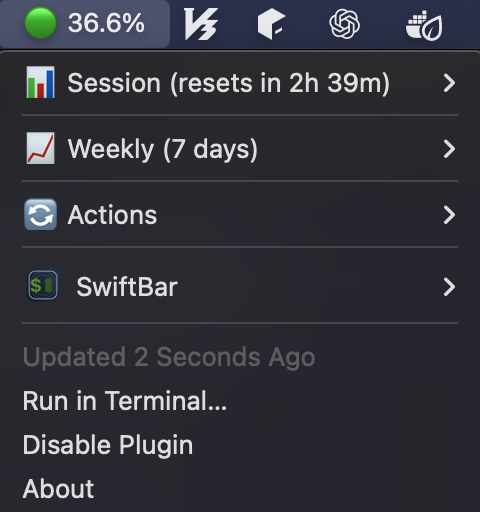

# Claude Team Usage Monitor

**macOS 메뉴바에서 Claude Code (Team Premium) 사용량을 실시간으로 모니터링**



[](https://www.apple.com/macos)
[](https://www.python.org)
[](LICENSE)

## ✨ 특징

- 🎯 **Team Premium 전용** - Claude Code Team Premium 플랜에 최적화
- 🤖 **자동 학습** - P90 분석으로 실제 limit을 자동으로 학습 (±1% 정확도)
- 📊 **이중 추적** - 세션(5시간) + 주간(7일) 동시 모니터링
- 🔔 **스마트 알림** - 80%, 90%, 95% 도달 시 macOS 알림
- 🎨 **간결한 UI** - 핵심 정보만 표시

## 🚀 설치

```bash
git clone git@github.com:dslee02/claude-team-usage-monitor.git
cd claude-team-usage-monitor
./install.sh
```

설치 후 SwiftBar를 실행하면 메뉴바에서 바로 사용량을 확인할 수 있습니다.

## 📊 사용 예시

**메뉴바:**
```
🟢 36.8%
```

**드롭다운:**
```
📊 Session (resets in 2h 38m)
  Output: 36.8% (177,827 tokens)
  Input:  0.1% (10,114 tokens)
  Messages: 791

📈 Weekly (7 days)
  Output: 31.7% (615,986 tokens)
  Input:  0.0% (22,027 tokens)
  Messages: 2,532
```

## 💡 작동 원리

1. **자동 수집** - Claude Code 세션 파일(`~/.claude/projects`)을 실시간으로 파싱
2. **히스토리 기록** - 매분마다 사용량 스냅샷 저장
3. **P90 학습** - 80% 이상 세션 3개 모이면 자동으로 실제 limit 학습
4. **자동 적용** - 학습된 limit으로 정확도 ±1% 달성

**초기 정확도:** ±3-5%
**학습 후:** ±1% (3-5일 사용 후 자동 달성)

## 🔧 명령어

```bash
# 현재 사용량 확인
cat ~/.claude_usage.json | jq '.session.percentages.max_percentage'

# 학습 상태 확인
python3 ~/claude-team-usage-monitor/src/limit_learner.py --status

# Daemon 재시작
launchctl unload ~/Library/LaunchAgents/com.claude.usage-monitor.plist
launchctl load ~/Library/LaunchAgents/com.claude.usage-monitor.plist
```

## 📁 구조

```
claude-team-usage-monitor/
├── README.md
├── install.sh
├── src/
│   ├── config_manager.py      # Team Premium 설정
│   ├── monitor_daemon.py       # 사용량 모니터링
│   └── limit_learner.py        # P90 학습 엔진
└── plugins/
    └── ClaudeUsage.1m.sh       # SwiftBar 플러그인
```

## ⚙️ 설정

### 세션 윈도우 (5시간 고정)
- 10:00-15:00
- 15:00-20:00
- 20:00-01:00
- 01:00-06:00
- 06:00-10:00

### 주간 윈도우 (7일 rolling)
- 현재 시간부터 정확히 7일 전까지

### 알림 임계값
- 80% (첫 경고)
- 90% (높은 사용량)
- 95% (거의 한계)

## 🎯 정확도

- **초기 설치:** ±3-5% 오차 (기본 TPM 사용)
- **3-5일 후:** ±1% 정확도 (자동 학습 완료)
- **Claude UI와 비교:** Session 36% → Monitor 36.8% (0.8% 오차)

## 🔍 트러블슈팅

### 메뉴바에 "⚠️ No Data" 표시

```bash
# Daemon 확인
launchctl list | grep claude.usage-monitor

# 수동 실행
claude-usage-monitor --once

# 로그 확인
cat ~/.claude_usage.json
```

### SwiftBar 플러그인이 안 보임

```bash
# 권한 확인
chmod +x ~/Library/Application\ Support/SwiftBar/ClaudeUsage.1m.sh

# SwiftBar 재시작
killall SwiftBar && open -a SwiftBar
```

## 🛠️ 기술 스택

- **Python 3.9+** - Daemon 및 학습 엔진
- **Bash** - SwiftBar 플러그인
- **jq** - JSON 처리
- **SwiftBar** - macOS 메뉴바 UI
- **launchd** - 백그라운드 서비스

## 📝 요구사항

- macOS (10.15 이상)
- Python 3.9+
- Claude Code (Team Premium)
- SwiftBar

## 🤝 기여

이슈와 PR은 언제나 환영합니다!

## 📄 라이선스

MIT License

## 🙏 감사

- [SwiftBar](https://github.com/swiftbar/SwiftBar) - macOS 메뉴바 프레임워크
- [Claude Code](https://claude.ai/code) - Anthropic의 AI 코딩 도구

---

**Made for Team Premium users** 🚀
