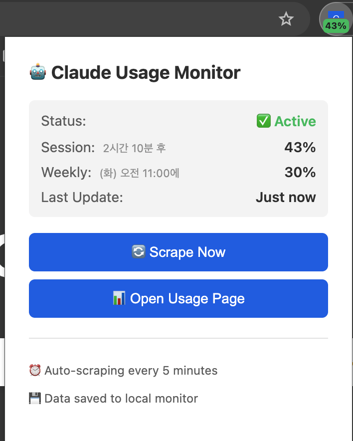
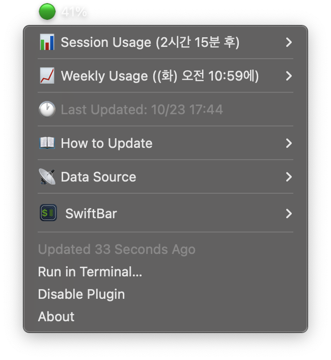

# Claude Usage Monitor

**Chrome Extension + SwiftBar로 Claude 사용량을 실시간 모니터링**

[](https://chromewebstore.google.com/detail/lpgoibedpckcimdgdeedmbakgnngkdhh)


## 🚀 빠른 시작

### Chrome Extension (모든 OS)

**[Chrome Web Store에서 설치](https://chromewebstore.google.com/detail/lpgoibedpckcimdgdeedmbakgnngkdhh)** ✅

설치 후 바로 사용 가능합니다!

### macOS SwiftBar 연동 (선택)

Extension + 메뉴바 통합을 원하면:
```bash
git clone https://github.com/dasol02/claude-monitor-usage.git
cd claude-monitor-usage
./install.sh
```

## 📌 지원 플랫폼 및 플랜

### ✅ 지원 Claude 플랜
- **Claude Pro** (개인 사용자)
- **Claude Team** (팀 사용자)
- **Claude Enterprise** (기업 사용자)

> 💡 **https://claude.ai/settings/usage** 페이지에서 사용량을 확인할 수 있는 모든 플랜에서 작동합니다!

### ✅ 지원 환경
- **Browser**: Chrome (Chrome Extension)
- **OS**: macOS (SwiftBar 사용 시), Windows/Linux (Extension만)

### ❌ 미지원
- **Safari, Edge, Firefox**: Chrome Extension API 미호환
- **Windows, Linux**: SwiftBar는 macOS 전용 (Extension 단독 사용은 가능)

## ✨ 주요 기능

- 🔄 **완전 자동화**: Chrome Extension 클릭 → 1-3초 자동 업데이트
- 📊 **실시간 표시**: Session/Weekly 사용량 + Reset Time을 Mac 메뉴바에 표시
- 🟢 **색상 코딩**: 사용량에 따른 자동 색상 (녹색/노란색/빨간색)
- ⚡ **빠른 동기화**: 자동 파일 감지로 즉시 업데이트
- 🧹 **자동 정리**: 다운로드 이력 자동 삭제로 깔끔한 관리
- 🎯 **간단한 구조**: 100줄의 간결한 코드

## 📋 구성

```
Chrome Extension (스크래핑)
    ↓ (1-3초)
Watcher (자동 감지)
    ↓
SwiftBar (메뉴바 표시)
```

## 🚀 설치 및 사용

### 🎯 빠른 설치 (macOS)

```bash
# 프로젝트 클론
git clone https://github.com/dasol02/claude-monitor-usage.git
cd claude-monitor-usage

# 자동 설치 (SwiftBar + 스크립트)
./install.sh
```

**설치되는 것들:**
- ✅ 필요한 스크립트들 (`~/.local/bin/`)
- ✅ SwiftBar 플러그인
- ✅ 의존성 확인 (fswatch, jq)

---

### 1️⃣ Chrome Extension 설치

1. Chrome 열기
2. `chrome://extensions/` 접속
3. **개발자 모드** 켜기 (우측 상단)
4. **압축해제된 확장 프로그램을 로드합니다** 클릭
5. `chrome-extension` 폴더 선택

### 2️⃣ SwiftBar 연동 (macOS만 해당)

**자동 설치를 사용한 경우:**
```bash
# Watcher 시작 (자동 동기화)
claude-start-extension-watcher
```

**수동 설치:**
1. [SwiftBar](https://github.com/swiftbar/SwiftBar/releases) 설치
2. SwiftBar 플러그인 폴더 확인
3. `ClaudeUsage.1m.sh`를 플러그인 폴더로 복사
4. 필요한 스크립트 설치:
   ```bash
   # scripts/ 폴더의 파일들을 ~/.local/bin/으로 복사
   cp scripts/* ~/.local/bin/
   chmod +x ~/.local/bin/claude-*
   ```

### 3️⃣ 완료!
- Chrome Extension Badge에서 사용량 확인
- macOS: SwiftBar 메뉴바에서도 확인 가능

## 💡 사용 방법

### Chrome Extension만 사용

1. Extension 아이콘 클릭
2. Popup에서 사용량 확인
3. "Scrape Now" 버튼으로 수동 업데이트

### SwiftBar와 함께 사용

1. Chrome Extension에서 "Scrape Now" 클릭
2. 1-3초 후 SwiftBar 자동 업데이트
3. Mac 메뉴바에서 사용량 확인

## 📊 표시 예시

### Chrome Extension



**기능:**
- 🟢 Badge: Extension 아이콘에 사용량 % 표시
- 📊 Popup: 상세 사용량 + Reset Time
- 🔄 Scrape Now: 수동 업데이트 버튼

### macOS SwiftBar (메뉴바)



**기능:**
- 🟢 메뉴바 아이콘: 한눈에 사용량 확인
- 📊 Session Usage: 재설정 시간 포함
- 📈 Weekly Usage: 주간 사용량
- 🕐 Last Updated: 마지막 업데이트 시간

### 색상 의미
- 🟢 **녹색** (0-49%): 안전
- 🟡 **노란색** (50-79%): 주의
- 🔴 **빨간색** (80-100%): 위험

## 🔧 관리

### Watcher 상태 확인
```bash
# 실행 중인지 확인
ps aux | grep claude-extension-watcher

# 재시작
killall claude-extension-watcher
claude-start-extension-watcher
```

### 자동 시작 설정 (선택)
```bash
# LaunchAgent 로드 (Mac 시작 시 자동 실행)
launchctl load ~/Library/LaunchAgents/com.claude.extension.watcher.plist
```

### 수동 입력 (백업 방법)
```bash
# Extension이 작동하지 않을 경우
claude-manual-update <session%> <weekly%>

# 예시
claude-manual-update 22 25
```

## 🐛 문제 해결

### Extension이 작동하지 않음
1. `chrome://extensions/`에서 새로고침
2. 개발자 도구 Console 확인
3. Extension ID 확인: `chrome://extensions/` → 개발자 모드 → ID 복사

### SwiftBar 업데이트 안 됨
```bash
# SwiftBar 재시작
killall SwiftBar && open -a SwiftBar

# 데이터 파일 확인
cat /tmp/claude-web-usage.json

# Watcher 로그 확인
tail -f /tmp/claude-extension-watcher.log
```

## 📁 파일 구조

```
claude-monitor/
├── chrome-extension/       # Chrome Extension
│   ├── manifest.json
│   ├── background.js      # Service worker
│   ├── content.js         # 스크래핑
│   └── popup.html         # UI
├── ClaudeUsage.1m.sh      # SwiftBar 플러그인
└── README.md

~/.local/bin/
├── claude-extension-watcher        # 파일 감시
├── claude-start-extension-watcher  # Watcher 시작
├── claude-sync-from-extension      # 동기화
└── claude-manual-update            # 수동 입력
```

## 🎯 기술 스택

- **Chrome Extension**: Manifest V3, Service Worker, DataURL
- **Watcher**: fswatch (macOS)
- **SwiftBar**: Bash script (100 lines)
- **자동 시작**: LaunchAgent (macOS)

## 📖 상세 문서

- [chrome-extension/README.md](./chrome-extension/README.md) - Extension 상세 가이드
- [CHANGELOG.md](./CHANGELOG.md) - 변경 이력

## 📄 라이센스

MIT License

---

**Made for Claude Team Users**
